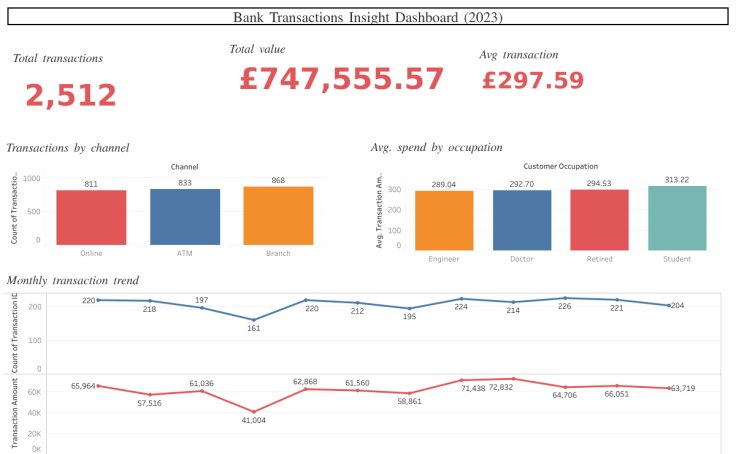

# 📊 Bank Transactions Insight Dashboard (2023)

This is my first Tableau project analyzing a dataset of **2,500+ bank transactions**.  
The goal was to explore transaction behavior across **channels, occupations, and time trends** — and to practice data visualization & storytelling.  

---

## 📸 Dashboard Preview

  

## 🔑 Key Insights
- Branch transactions (**868**) slightly outperformed ATM (**833**) and Online (**811**).  
- **Students** had the highest average spend (£313), followed by Retired (£295) and Doctors (£293).  
- Transaction volumes dipped in **March (161)** but peaked in **June (224)**.  
- Overall: **2,512 transactions worth £747,556**, with an **average spend of £298**.  

---

## 📊 Dashboard Features
- **Executive KPIs** → Total Transactions, Total Value, Avg Transaction  
- **Channel Analysis** → ATM vs Online vs Branch usage  
- **Occupation Insights** → Avg spend across professions  
- **Monthly Trends** → Transaction volume & value  

---

## 🚀 Tools Used
- **Tableau Public** → Dashboard creation & publishing  
- **Excel/CSV** → Dataset source  

---

## 🔗 Project Links
- **Interactive Tableau Dashboard:*(https://public.tableau.com/app/profile/blessey.carmichael/viz/BankTransactionsInsightDashboard2023/BankTransactionsInsightDashboard2023)

✨ This project is part of my **Data Analytics learning journey**.  
I’d love feedback and suggestions from the community!  
